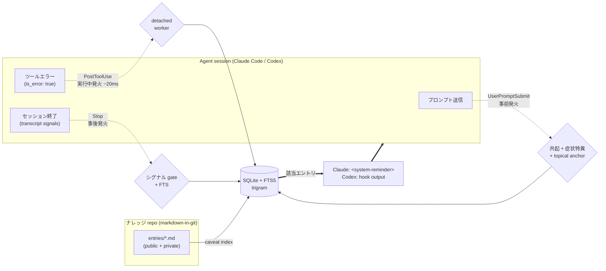

<p align="center">
  
</p>

# Caveat

[](https://www.npmjs.com/package/caveat-cli)
[](https://github.com/kitepon-rgb/Caveat/actions/workflows/ci.yml)
[](LICENSE)
[](https://nodejs.org/)
[](https://github.com/kitepon-rgb/Caveat/releases)

> **同じ罠を二度踏まないために。** Caveat は Claude Code と Codex のための長期記憶レイヤです。外部仕様の地雷を踏んで時間を溶かしたり、自分の repo 固有の独自設計を忘れたりしたとき、**一度書き留めておけば** 次に同じ場面に出くわした瞬間に自動で関連メモが浮上します（あなたが意識していなくても、AI が意識していなくても）。

🇬🇧 **English**: [README.md](README.md)

## 30 秒でわかる動作

```sh
npm install -g caveat-cli
caveat init                          # Claude Code MCP + hooks を登録
caveat codex-hook install            # 任意: Codex native hooks を登録
```

Claude Code または Codex の hook を有効にすると:

1. **プロンプト送信時** → `UserPromptSubmit` hook が **3 段の構造的ゲート**でマッチエントリを surface: 共起 + 症状セクション一致 + rare topical anchor。キーワード allowlist も stopword リストもなし。固有名詞だけの言及 (`RTX 5090 CUDA で何かやってる`) は silent、症状語彙と curated topic anchor (`cudaGetDeviceCount が 0 を返す`) が揃うと正解エントリだけ発火する。([詳細](CHANGELOG.md#0142--2026-05-06))
2. **ツールがエラー返却したとき** → Claude hook は detached worker を起動して非同期に検索し、結果は次の hook tick で載ります。Codex hook は現行 payload と transcript timing の都合で bounded foreground lookup を行い、次の `UserPromptSubmit` で結果を載せます。現在の Claude Code では failed-tool payload 用に `PostToolUseFailure` も登録します。
3. **セッション終了時** → `Stop` hook が transcript を解析し、客観的な「もがきシグナル」（ツール失敗、同一ファイル複数編集、Web 検索、Bash 再実行）を抽出。一つでも観測されれば、最終回答を汚さないよう reminder を次の hook tick 向けに compact して積み、次ターンで実行中の agent に既存エントリの更新か新規記録を促します。

Claude は Caveat reminder を `<system-reminder>` として受け取り、MCP tools で
search / record / update できます。Codex primary session は Codex native hook
runtime と Codex 用 formatter を使います。この経路は Caveat CLI を直接呼ぶ統合であり、
`codex-sidecar` を呼ぶ経路ではありません。sidecar は境界のある second opinion、
review、risk-check、isolated work 用に残します。

ナレッジ repo は **markdown-in-git** が真実の源。Obsidian の vault としてそのまま開けます。チームで共有したければ普通に `git push` すれば良い。中央サーバは存在しません — 信頼は「自動検査」ではなく「**社会的文脈**」で引きます（あなた・チーム・組織が誰を購読するかで決まる、`caveat community add <github-url>`）。

## 競合との違い

| | **Caveat** | `.cursorrules` / `CLAUDE.md` / `AGENTS.md` | ドキュメント RAG | Notion / Obsidian（手動） |
|---|---|---|---|---|
| 関連コンテキストの **自動 surface** | ✅ 3 発火点 hook | ❌ 常時 on、コンテキスト圧迫 | ⚠️ 明示クエリ要 | ❌ 自分で思い出す |
| 罠ごとの粒度で取り出し | ✅ FTS5 共起 | ❌ モノリシックなファイル | ✅ embeddings | ❌ |
| 真実の源 | markdown-in-git | 単一の rules ファイル | vector DB | プロプライエタリ |
| セッションから新規罠を記録 | ✅ `caveat_record` MCP tool | ❌ | ❌ | 手動 |
| AI が自覚しないもがきも検出 | ✅ transcript シグナル抽出 | ❌ | ❌ | ❌ |
| 外部仕様の罠と repo 固有メモを混在管理 | ✅ public / private 2 tier | ⚠️ 分離なし | ⚠️ | ⚠️ |

**ステータス**: v0.14.3、242 tests passing。個人および小規模チームが主な想定ユースケースです。中央 DB なし、インストール時の自動購読なし。

<details>
<summary><strong>なぜ中央 DB を持たない？</strong>（v0.7 での方針転換）</summary>

以前のバージョンは中央の shared community DB を持ち、`caveat push`（fork + PR）と `caveat init` の自動購読で運用していました。これは廃止しました — **赤の他人の貢献を auto-validate するモデルが原理的に脆弱** だからです。LLM oracle を gate に置いても adversarial-gradient 攻撃で破られ、xz-utils 型の long-game は静的検査で検知不能。よって信頼は「自動検査」ではなく「社会的文脈」で引く方針に転換しました。詳細は [docs/plan.md](docs/plan.md) と [廃案になった自動マージ設計](docs/archive/auto-merge-design.md) 参照。
</details>

<details>
<summary><strong>「private」エントリって何？</strong>（v0.11 での tier 拡張）</summary>

「**第三者再現性**」で 2 tier に分けます:

- **Public** — 同じ外部ツール・仕様を使えば誰でも踏める罠（GPU ドライバ、ネイティブモジュールビルド、IDE の癖、バージョン制約等）。
- **Private** — コードを読むだけでは復元できない repo 固有の非自明文脈（意図的な非標準挙動、upstream 修正待ちのワークアラウンド、プロジェクト横断の個人的な慣習等）。

判定基準は `caveat_record` のツール記述に書かれており、実行中の agent がその二項基準で分類します（ユーザの明示指示が最優先）。`.husky/pre-commit` のゲートが `visibility: private` のエントリを共有 repo にコミットさせない仕組み。検索は意図的にフラット — 本文の語彙が自然に仕分けます（public は外部ツール名、private は repo 固有識別子）。詳細は [docs/private-tier-design.md](docs/private-tier-design.md)。
</details>

## アーキテクチャ


```mermaid
flowchart LR
    subgraph KB["ナレッジ repo (markdown-in-git)"]
        MD["entries/*.md<br/>(public + private)"]
    end

    MD -->|caveat index| FTS[("SQLite + FTS5<br/>trigram")]

    subgraph AG["Agent session (Claude Code / Codex)"]
        P["プロンプト送信"]
        T["ツールエラー<br/>(is_error: true)"]
        S["セッション終了<br/>(transcript signals)"]
    end

    P -.->|"UserPromptSubmit<br/>事前発火"| H1{"共起 + 症状特異<br/>+ topical anchor"}
    T -.->|"PostToolUse<br/>実行中発火 ~20ms"| H2{"detached<br/>worker"}
    S -.->|"Stop<br/>事後発火"| H3{"シグナル gate<br/>+ FTS"}

    H1 --> FTS
    H2 --> FTS
    H3 --> FTS

    FTS ==>|該当エントリ| R["Claude: &lt;system-reminder&gt;<br/>Codex: hook output"]
    R ==> AG
```

- **`markdown-in-git`** が真実の源。SQLite (FTS5 trigram) は再構築可能な派生 index で gitignore 済
- 3 つの発火タイミング (UserPromptSubmit / PostToolUse 系 / Stop) は **同じ共起 FTS ロジック** を異なる入力（プロンプト / ツールエラー / セッションシグナル）で再利用
- Claude ではマッチした既存エントリを最大 1 個の `<system-reminder>` でコンテキストに注入、Codex では Codex 用 hook output として返す
- Codex primary hook adapter は `~/.codex/hooks.json` に `UserPromptSubmit` /
  `PostToolUse` / `Stop` を登録し、Codex payload parser と Codex stdout formatter
  だけを差し替えて同じ Caveat ロジックを使います。Claude hook stdout は 1 invocation
  につき最大 1 個の `<system-reminder>` block、Codex hook stdout は単一 JSON object
  とし、pending reminder は compact してから 1 つの host-specific context 文字列へ結合します
- Claude-hosted session では、`codex-sidecar` が operational な project に限り、PostToolUse 系 / Stop の既存リマインダー末尾に Codex の second opinion を追記できます。Caveat の発火判定や記録思想は変えず、助言だけを外部化する補助経路です

## クイックスタート（NPM ユーザ）

```sh
npm install -g caveat-cli
caveat init                                                # 初回セットアップ
caveat codex-hook install                                  # 任意: Codex native hook セットアップ
caveat search "rtx"                                        # ローカルエントリを検索
caveat community add https://github.com/acme-corp/caveats  # チームの repo を購読
caveat pull                                                # 購読 repo を git-pull + 再 index
caveat serve                                               # http://localhost:4242/ 読み取り専用ポータル
```

Claude Code 向けの `caveat init` の動作:
- `~/.caveatrc.json` を生成（中身は空 `{}` — デフォルトは CLI 内部の定数）
- `~/.caveat/own/`（ナレッジ repo ルート）と `~/.caveat/index/caveat.db` を scaffold
- `claude mcp add --scope user caveat ...` で MCP サーバを登録
- `~/.claude/settings.json` に `UserPromptSubmit` / `PostToolUse` / `PostToolUseFailure` / `Stop` hook をマージ（既存エントリは保持、書き込み前にバックアップ作成）

`--skip-claude` で Claude 連携をスキップ、`--dry-run` でプレビュー。`caveat uninstall` で `~/.caveat/` を残したまま Claude 連携だけ解除。**自動購読される中央 DB はありません** — 知識ソースは `caveat community add` で明示的に追加してください。

Codex 側は `caveat codex-hook diagnostics` で事前確認できます。diagnostics は
Codex hook runtime が使えるかと、Caveat-owned hooks が install 済みかを分けて表示します。

### チーム / 会社で共有する

Caveat は publish フローを持ちません。推奨パターンは普通の git:

1. 誰か一人が GitHub repo を作成（private / public どちらでも可）。例: `acme-corp/caveats`、ルートに `entries/` ディレクトリ。
2. 各コントリビュータは (a) その repo を自分の `~/.caveat/own/` にする（`~/.caveatrc.json` の `knowledgeRepo` で指定）か、(b) 自分の `~/.caveat/own/` を別途持って共有可能なエントリだけ手動で team repo に cherry-pick する。
3. 読みたい人は `caveat community add https://github.com/acme-corp/caveats` してから `caveat pull`。

書き込み権限は team repo 側で管理されるので、共有経路は `git push` だけ。tool は介在しません。

## 開発（Caveat 本体への貢献）

```sh
corepack pnpm install
corepack pnpm -r build
cd apps/cli && corepack pnpm pack        # caveat-cli-<ver>.tgz
npm install -g ./caveat-cli-<ver>.tgz    # PATH に caveat が入る
```

npm release は `apps/cli` で `corepack pnpm publish` を使います。
`npm publish` を直接使うと packed manifest に `workspace:*` が残るため禁止です。

iterative 開発時は `apps/cli/` 内で `npm link` するとグローバル shim がローカルビルドを追従します。

詳細は英語版 [README.md](README.md) と [CONTRIBUTING.md](CONTRIBUTING.md) を参照してください。

## ライセンス

MIT
