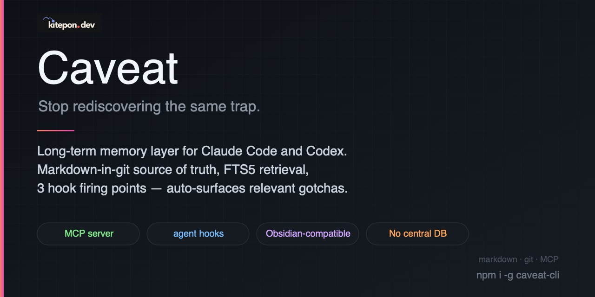
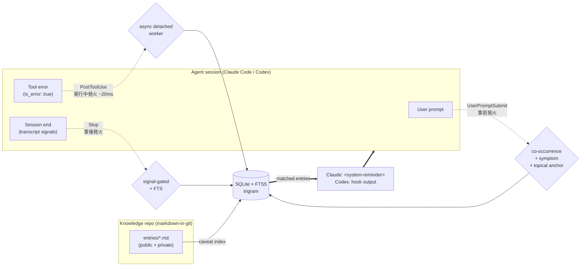

<p align="center">
  
</p>

# Caveat

[](https://www.npmjs.com/package/caveat-cli)
[](https://github.com/kitepon-rgb/Caveat/actions/workflows/ci.yml)
[](LICENSE)
[](https://nodejs.org/)
[](https://github.com/kitepon-rgb/Caveat/releases)

> **Stop rediscovering the same trap.** Caveat is a long-term memory layer for Claude Code and Codex: every time you bleed for an external-spec quirk or a repo-specific oddity, write it down once — and the next time anyone (you or your AI) is about to step on the same rake, the relevant note surfaces automatically.

🇯🇵 **日本語版**: [README.ja.md](README.ja.md)

## What it does in 30 seconds

```sh
npm install -g caveat-cli
caveat init                          # registers Claude Code MCP + hooks
caveat codex-hook install            # optional: register native Codex hooks
```

With Claude Code or Codex hooks enabled:

1. **You type a prompt** → `UserPromptSubmit` hook surfaces matching entries via three structural gates: **co-occurrence + symptom-section match + rare topical anchor**. No keyword lists. Bare proper-noun mentions (`RTX 5090 CUDA で何かやってる`) stay silent; specific failure vocabulary plus a curated topic anchor (`cudaGetDeviceCount が 0 を返す`) fires the right entry. ([details](CHANGELOG.md#0142--2026-05-06))
2. **A tool returns an error** → Claude hooks spawn a detached worker that searches in the background; the matching caveat lands on the next hook tick (~20ms foreground latency). Codex hooks do a bounded foreground lookup and surface the result on the next `UserPromptSubmit`. Claude Code also registers `PostToolUseFailure` for current failed-tool payloads.
3. **The session ends** → `Stop` hook parses the transcript for objective struggle signals (tool failures, repeated edits, web searches, bash retries). If any are present, it nudges the active agent to update an existing entry or record a new one.

Claude receives Caveat reminders as `<system-reminder>` blocks and can use the
MCP tools to search, record, and update entries. A primary Codex session uses
Codex's native hook runtime and Codex-formatted hook output. That path calls
Caveat CLI directly; `codex-sidecar` remains for bounded second opinions,
review, risk-check, and isolated work.

The knowledge repo is plain markdown-in-git. Open it as an Obsidian vault. Share it as a team repo with `git push`. There is no central server — trust is defined **socially**, by who you choose to subscribe to via `caveat community add <github-url>`.

## How it compares

| | **Caveat** | `.cursorrules` / `CLAUDE.md` / `AGENTS.md` | RAG over docs | Notion / Obsidian (manual) |
|---|---|---|---|---|
| Surfaces context **automatically** | ✅ 3 hook firing points | ❌ always-on, fills context | ⚠️ on explicit query | ❌ manual recall |
| Granular per-trap retrieval | ✅ FTS5 co-occurrence | ❌ monolithic file | ✅ embeddings | ❌ |
| Source of truth | markdown-in-git | a single rules file | vector DB | proprietary |
| Records new traps from session | ✅ via `caveat_record` MCP tool | ❌ | ❌ | manual |
| Catches struggle the AI didn't self-report | ✅ transcript signal mining | ❌ | ❌ | ❌ |
| Mixes external-spec gotchas with repo-specific context | ✅ public / private tiers | ⚠️ no separation | ⚠️ | ⚠️ |

**Status**: v0.14.2, 238 tests passing. Single-user and small-team workflows are the primary supported path. No central DB; no auto-subscription on install.

<details>
<summary><strong>Why no central shared DB?</strong> (v0.7 pivot)</summary>

Earlier versions ran a central shared community DB with `caveat push` (fork + PR) and auto-subscribe on `caveat init`. That model was retired because trust over arbitrary stranger contributions cannot be reliably automated — sophisticated malicious payloads survive static gates and adversarial-gradient attacks against any LLM-based oracle. xz-utils-style long games are undetectable by static review. Trust is now defined socially (you, your team, your org). See [docs/plan.md](docs/plan.md) and the [abandoned auto-merge design](docs/archive/auto-merge-design.md).
</details>

<details>
<summary><strong>What's a "private" entry?</strong> (v0.11 tier expansion)</summary>

Two tiers, distinguished by **third-party reproducibility**:

- **Public** — external-spec gotchas any third party running the same tool/spec can hit (GPU drivers, native-module builds, IDE quirks, version constraints).
- **Private** — repo-specific non-obvious context that code reading alone cannot reconstruct (intentional non-standard behavior, workarounds awaiting upstream fixes, cross-project personal conventions).

Classification is automatic via a binary criterion in the `caveat_record` tool description; explicit user instruction always overrides. The pre-commit visibility gate keeps `private` entries out of any shared git repo. Retrieval is deliberately flat — body vocabulary naturally segregates the tiers (public bodies contain external tool names; private bodies contain repo-specific identifiers). See [docs/private-tier-design.md](docs/private-tier-design.md).
</details>

## Concept



- **`markdown-in-git` is the source of truth.** SQLite (FTS5 trigram) is a rebuildable derived index, gitignored.
- **Per-group sharing via plain git.** Your `~/.caveat/own/` is yours. Share via any git repo (your own, a team's `acme-corp/caveats`, etc.). Subscribers add it with `caveat community add <github-url>`; updates flow via `caveat community pull`. The tool stays out of the publish path.
- **`visibility: public | private`** frontmatter + `.husky/pre-commit` gate keeps private entries out of any repo you commit to.
- **Agent integrations.** Claude Code gets an MCP server exposing 6 tools (`caveat_search` / `caveat_get` / `caveat_record` / `caveat_update` / `caveat_list_recent` / `caveat_pull`) plus hooks. Codex gets native hooks through `caveat codex-hook install`. Both surfaces reuse the same retrieval gates — no hardcoded keyword lists:
  - **UserPromptSubmit** (事前発火): when you submit a prompt, tokenize it (path-stripping + self-identity + pure-hiragana glue removal + CJK group dedup), FTS the DB, and surface entries that pass **three structural gates** — (1) ≥ 2 distinct group matches (co-occurrence), (2) ≥ 1 match in the entry's `## Symptom` section (failure-state evidence), (3) ≥ 1 corpus-rarest prompt token in `topical_text` (title + tags + environment values, topic evidence). Bare proper-noun mentions like `RTX 5090 CUDA で何かやってる` stay silent; only specific failure-state vocabulary plus a curated topic anchor (`cudaGetDeviceCount`, `SQLITE_READONLY`, …) fires the gate. No hardcoded word lists.
  - **PostToolUse** (+ Claude **PostToolUseFailure**) (実行中発火): when a tool returns `is_error: true` or Claude Code emits a failed-tool `error` payload, Claude spawns a detached worker so the foreground hook returns in ~20ms. Codex performs a bounded foreground lookup because current Codex payloads and transcript timing make detached workers unreliable there. In both cases, the reminder lands on the next hook tick. In Claude-hosted sessions, an operational `codex-sidecar` can append Codex advice after Caveat's original text.
  - **Stop** (事後発火): parse the session transcript for objective struggle signals (tool failures, repeated file edits, web searches, bash retries). If any are present, surface matching entries and nudge `caveat_update` or `caveat_record`. In Claude-hosted sessions, optional Codex advice can challenge or sharpen that nudge without replacing Caveat's trigger logic.
- **Codex primary hook adapter.** `caveat codex-hook install` registers
  `UserPromptSubmit`, `PostToolUse`, and `Stop` in `~/.codex/hooks.json` and
  enables `[features].codex_hooks = true`. It reuses Caveat's existing search,
  pending-reminder, and stop-signal logic with Codex-specific payload parsing
  and stdout formatting. Codex hook stdout is a single JSON object per
  invocation; pending reminders are compacted before being joined into one
  context string.
- **Obsidian-compatible.** The knowledge repo is a valid Obsidian vault — open it as a folder, edit with Obsidian's graph/backlinks/Dataview, the tool re-indexes on `caveat index`.

## Layout

```
packages/core/        @caveat/core — DB (node:sqlite + FTS5 trigram), indexer, frontmatter,
                      env fingerprint, repository, record/update, community, paths,
                      shared hook retrieval logic (claudeHooks.ts; Claude name
                      retained for the canonical Claude contract)
apps/cli/             caveat-cli (published to npm) — bundled CLI with subcommands:
                        init / uninstall / index [--full] / search / list / stale / show /
                        stats / serve / mcp-server / hook <name> / community add|pull|list /
                        codex-hook install|uninstall|diagnostics|... /
                        codex-sidecar diagnostics|smoke|run|work-smoke
apps/mcp/             @caveat/mcp — stdio MCP server exposing 6 tools via
                      @modelcontextprotocol/sdk. Imported by caveat-cli as `mcp-server`
apps/web/             @caveat/web — Hono SSR read-only share portal (/, /g/:id, /community) +
                      custom markdown-it wikilinks plugin for [[slug]] → /g/slug rendering
hooks/                pre-commit-visibility-gate.mjs (run by .husky/pre-commit) — thin
                      re-export wrapper around @caveat/core's findBlockedFiles
.husky/               git pre-commit wiring (husky 9)
docs/plan.md          Design source of truth (audited through Round 5, then extended
                      Phase 2 → 12 with implementation findings)
docs/audit.md         Audit history (rejected proposals preserved so they don't reappear)
docs/archive/         Superseded drafts (legacy brainstorms, etc.)
```

## Requirements

- **Node 22.5+** (for `node:sqlite`). Verified on Node 24.14 with bundled SQLite 3.51.2.
- **pnpm 10** via corepack (pinned in root `package.json`'s `packageManager`).
- **git** for community import (`simple-git` shells out to the system git).

## Quick start (NPM user)

```sh
npm install -g caveat-cli
caveat init                                                # one-time setup (see below)
caveat codex-hook install                                  # optional native Codex hook setup
caveat search "rtx"                                        # search your local entries
caveat community add https://github.com/acme-corp/caveats  # subscribe to a group repo
caveat pull                                                # git-pull subscribed repos and re-index
caveat serve                                               # http://localhost:4242/ read-only portal
```

What `caveat init` does on first run for Claude Code:
- Writes `~/.caveatrc.json` (empty `{}` — defaults come from a constant in the CLI)
- Scaffolds `~/.caveat/own/` (your knowledge repo root) + `~/.caveat/index/caveat.db`
- Runs `claude mcp add --scope user caveat -- <node> --disable-warning=ExperimentalWarning <cliPath> mcp-server`
- Merges `UserPromptSubmit` / `PostToolUse` / `PostToolUseFailure` / `Stop` hook entries into `~/.claude/settings.json` (existing entries preserved; backup written before any change)

Use `--skip-claude` to skip Claude Code wiring, or `--dry-run` to preview. `caveat uninstall` reverses Claude Code changes without touching `~/.caveat/`. **No central DB is auto-subscribed** — add knowledge sources explicitly with `caveat community add`.

For Codex, run `caveat codex-hook diagnostics` first if you want a health check.
It reports hook availability separately from whether Caveat-owned hooks are
installed.

### Sharing with a group / team / company

Caveat does not ship a publish flow. The recommended pattern is plain git:

1. One person creates a GitHub repo (private or public), e.g. `acme-corp/caveats`, with an `entries/` directory.
2. Each contributor either (a) makes that repo their `~/.caveat/own/` (set `knowledgeRepo` in `~/.caveatrc.json`) and writes directly into it, or (b) keeps a separate `~/.caveat/own/` and copies/cherry-picks shareable entries into the team repo by hand.
3. Anyone who wants to read those caveats: `caveat community add https://github.com/acme-corp/caveats` then `caveat pull`.

Because contributors have write access to their own group repo, this is just `git push`; the tool stays out of the path.

### Using an existing knowledge repo instead of `~/.caveat/own/`

Write `~/.caveatrc.json`:

```json
{
  "knowledgeRepo": "/absolute/path/to/your/caveats-repo"
}
```

(v0.2+) `source_project` is always written as `null` by `caveat_record`. It used to be auto-inferred from cwd via a `projectRoots` config field, but that leaked per-user project names into publicly-shared knowledge repos and has been removed. Set it manually in the md file if you want personal traceability on private entries.

## Quick start (dev — contributing to Caveat itself)

```sh
corepack pnpm install
corepack pnpm -r build
cd apps/cli && corepack pnpm pack        # caveat-cli-<ver>.tgz
npm install -g ./caveat-cli-<ver>.tgz    # now `caveat` is on PATH
```

For iterative dev, `npm link` inside `apps/cli/` keeps the global shim tracking your local build.

### (Optional) Pre-commit gate on your knowledge repo

The tool repo already has `.husky/pre-commit` wired. To enable the same gate on your knowledge repo so private entries can't leak:

```sh
cd /path/to/your/caveats-repo
npm init -y   # or pnpm init
npm install --save-dev husky
npx husky init

# Copy the gate script:
cp /path/to/Caveat/hooks/pre-commit-visibility-gate.mjs hooks/
# Edit .husky/pre-commit to exec that script (one line: `exec node "$(dirname "$0")/../hooks/pre-commit-visibility-gate.mjs"`)
```

The gate rejects any commit that stages an `entries/**/*.md` with `visibility: private`. Bypass only with `git commit --no-verify` (git standard), not a custom flag.

### (Optional) Open knowledge repo in Obsidian

Your knowledge repo (default `~/.caveat/own/`) is a valid Obsidian vault. `File → Open folder as vault`. Recommended plugins:

| Plugin | Purpose |
|---|---|
| **Templates** (core) | Settings > Templates → folder `.templates/`. Then `Insert template` inserts the frontmatter skeleton. |
| **Obsidian Git** | Sync your vault to GitHub from inside Obsidian. |
| **Dataview** | Frontmatter queries. E.g. `TABLE confidence, environment.gpu FROM "entries" WHERE outcome = "impossible"`. |

Caveats authored in Obsidian are picked up by `caveat index` on next run (FTS is eventually consistent; MCP `caveat_record` syncs immediately).

## Subscribing to other people's / team caveat repos

```sh
caveat community add https://github.com/alice/caveats-alice
caveat community pull         # refresh all subscribed repos
caveat community list
caveat community remove <handle>   # unsubscribe + purge db rows
caveat index                  # re-index to pick up new entries (or use `caveat pull` for the combined flow)

# Then search only their contributions:
caveat search "foo" --source community
```

URL validation is strict — only `^https://github.com/<org>/<repo>(\.git)?/?$` is accepted. GitLab / SSH / HTTP are rejected in v1.

## Knowledge repo format

Each caveat is a markdown file with YAML frontmatter. Example:

```markdown
---
id: rtx-5090-cuda-12-compat
title: RTX 5090 で CUDA 12.4 以前が初期化失敗する
visibility: public
confidence: reproduced          # confirmed | reproduced | tentative
outcome: resolved               # resolved | impossible
tags: [gpu, nvidia, cuda]
environment:
  gpu: RTX 5090
  cuda: ">=12.5"
source_project: llm-infer-bench
source_session: "2026-04-18T12:34:56Z/abcdef012345"
created_at: 2026-04-18
updated_at: 2026-04-18
last_verified: 2026-04-18
---

## Symptom
## Cause
## Resolution
## Evidence
```

See [docs/plan.md](docs/plan.md) for the full schema, semver matching rules, and MCP tool specs.

## Development

```sh
corepack pnpm -r test            # 203 tests across 5 packages
corepack pnpm -r typecheck
corepack pnpm -r build
```

Per-package:
```sh
corepack pnpm --filter @caveat/core test
corepack pnpm --filter caveat-cli test
corepack pnpm --filter @caveat/mcp test
corepack pnpm --filter @caveat/web test
corepack pnpm --filter @caveat/hooks test
```

Contributing: see [CONTRIBUTING.md](CONTRIBUTING.md).

## License

MIT
